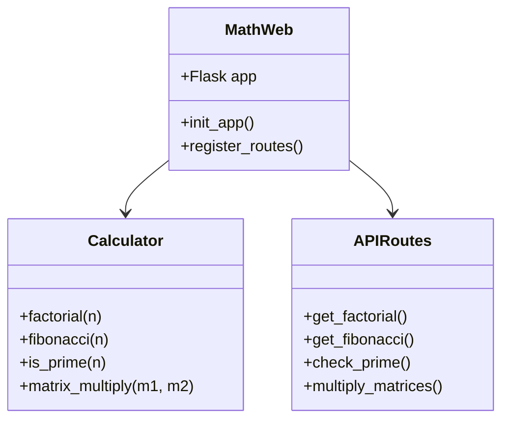

# Math Web Library

A powerful Python library for mathematical operations exposed through a web interface. This library provides a collection of mathematical functions accessible via REST API endpoints.

## Installation

Clone the repository:
```bash
git clone https://github.com/yourusername/mathweb.git
cd mathweb
```

Install dependencies:
```bash
pip install -r requirements.txt
```

## API Methods

| Method | Endpoint | Description | Parameters | Example |
|--------|----------|-------------|------------|---------|
| GET | /factorial/{n} | Calculates factorial of n | n: integer | /factorial/5 → 120 |
| GET | /fibonacci/{n} | Gets nth Fibonacci number | n: integer | /fibonacci/6 → 8 |
| POST | /matrix/multiply | Multiplies two matrices | matrices: JSON array | See example below |
| GET | /prime/{n} | Checks if n is prime | n: integer | /prime/7 → true |

### Example Usage

Matrix multiplication request:
```json
POST /matrix/multiply
{
    "matrix1": [[1, 2], [3, 4]],
    "matrix2": [[5, 6], [7, 8]]
}
```

## Class Diagram



## Use Cases

1. **Scientific Calculations**
   - Research applications requiring factorial calculations
   - Statistical analysis using matrix operations
   - Number theory investigations with prime numbers

2. **Educational Tools**
   - Teaching mathematical concepts
   - Interactive math learning platforms
   - Algorithm visualization

3. **Integration Examples**
   - Web applications
   - Mobile apps backend
   - Mathematical modeling software

## Need Help?

If you need assistance or want to report issues:

1. Check our [documentation](docs/README.md)
2. Open an issue on GitHub
3. Contact maintainers at: support@mathweb.example.com

For contribution guidelines, please read [CONTRIBUTING.md](CONTRIBUTING.md)

## License

This project is licensed under the MIT License - see the [LICENSE](LICENSE) file for details.
